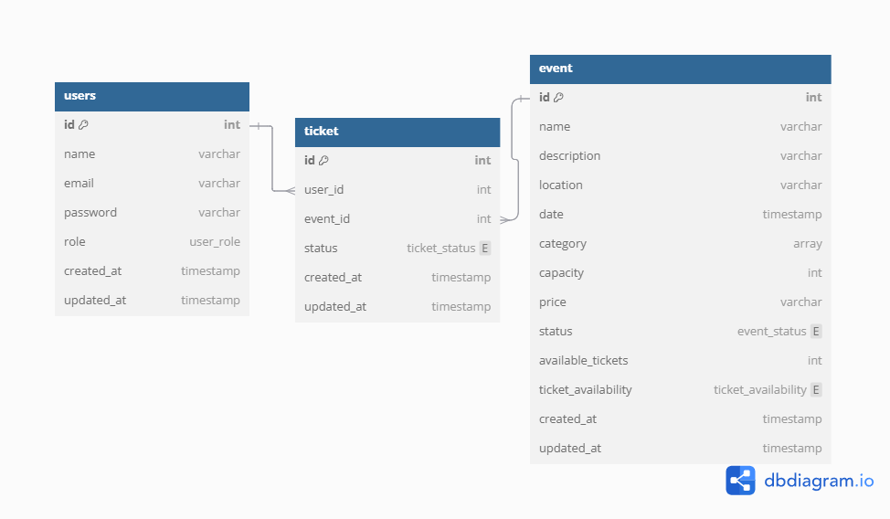

# Event Management System

This project is a backend API for an event management platform. It allows users to create events, purchase tickets, manage bookings, and generate reports. The API is built using Go (Golang) with the Gin framework and uses a MySQL database with GORM as the ORM.

## Table of Contents

1. [Features](#features)
2. [ERD](#erd)
3. [API Endpoints](#api-endpoints)
   - [User Endpoints](#user-endpoints)
   - [Event Endpoints](#event-endpoints)
   - [Ticket Endpoints](#ticket-endpoints)
4. [Middleware](#middleware)

---

## Features

- **User Management**: Register, login, update, and delete users. Users can register as admins.
- **Event Management**: Create, update, delete, and search for events.
- **Ticket Management**: Purchase tickets, update ticket status, and view ticket history.
- **Pagination**: All `GET` endpoints support pagination using `limit` and `page` query parameters.
- **Authentication & Authorization**: JWT-based authentication and role-based access control.

---

## ERD

---

## API Endpoints

### User Endpoints

| Method | Endpoint                     | Description                                  | Authentication Required |
| ------ | ---------------------------- | -------------------------------------------- | ----------------------- |
| POST   | `/register`                  | Register a new user                          | No                      |
| POST   | `/login`                     | Login and get JWT token                      | No                      |
| POST   | `/register-admin`            | Register a new admin                         | No                      |
| GET    | `/users/:id`                 | Get user details by ID                       | Yes                     |
| GET    | `/users`                     | Get all users (with pagination)              | Yes                     |
| PUT    | `/users/:id`                 | Update user details                          | Yes                     |
| DELETE | `/users/:id`                 | Delete a user                                | Yes                     |

---

### Event Endpoints

| Method | Endpoint                  | Description                                    | Authentication Required |
| ------ | ------------------------- | ---------------------------------------------- | ----------------------- |
| POST   | `/events`                 | Create a new event (admin only)                | Yes (Admin)             |
| GET    | `/events/:id`             | Get event details by ID                        | Yes                     |
| PUT    | `/events/:id`             | Update event details (admin only)              | Yes (Admin)             |
| DELETE | `/events/:id`             | Delete an event (admin only)                   | Yes (Admin)             |
| GET    | `/events`                 | Get all events (with pagination)               | Yes                     |
| GET    | `/events/search`          | Search events by query, min_price, max_price   | Yes                     |
| PATCH  | `/events/:id/cancel`      | Cancel an event (admin only)                   | Yes (Admin)             |
| GET    | `/events/report`          | Generate an event report (admin only)          | Yes (Admin)             |

---

### Ticket Endpoints

| Method | Endpoint                        | Description                                                      | Authentication Required |
| ------ | ------------------------------- | ---------------------------------------------------------------- | ----------------------- |
| GET    | `/tickets`                      | Get all tickets (with pagination)                               | Yes                     |
| GET    | `/tickets/:id`                  | Get ticket details by ID                                        | Yes                     |
| POST   | `/tickets`                      | Purchase a ticket                                               | Yes                     |
| PUT    | `/tickets/:id`                  | Update ticket details                                           | Yes                     |
| DELETE | `/tickets/:id`                  | Delete a ticket                                                 | Yes                     |
| GET    | `/tickets/user/:user_id`        | Get tickets by user ID                                          | Yes                     |
| PATCH  | `/tickets/:id/cancel`           | Cancel a ticket                                                 | Yes                     |
| GET    | `/tickets/report`               | Generate a ticket sales report (admin only)                     | Yes (Admin)             |
| GET    | `/tickets/report/event`         | Get tickets sold per event (admin only)                         | Yes (Admin)             |

---

## Middleware

### JWT Authentication (`auth.go`)

- **Purpose**: Validates JWT tokens in the `Authorization` header.
- **Behavior**:
  - Checks for the presence of the `Authorization` header.
  - Validates the token and extracts user claims (e.g., `user_id`, `role`).
  - Aborts the request if the token is invalid or expired.

### Role-Based Authorization (`role.go`)

- **Purpose**: Restricts access to endpoints based on user roles.
- **Behavior**:
  - Checks the user's role from the JWT claims.
  - Allows access only if the user's role matches one of the allowed roles.
  - Returns a `403 Forbidden` error if the user does not have permission.

---

## Acknowledgments

- [Gin Framework](https://github.com/gin-gonic/gin)
- [GORM](https://gorm.io/)
- [JWT](https://github.com/golang-jwt/jwt)
- [Bcrypt](https://pkg.go.dev/golang.org/x/crypto/bcrypt)
